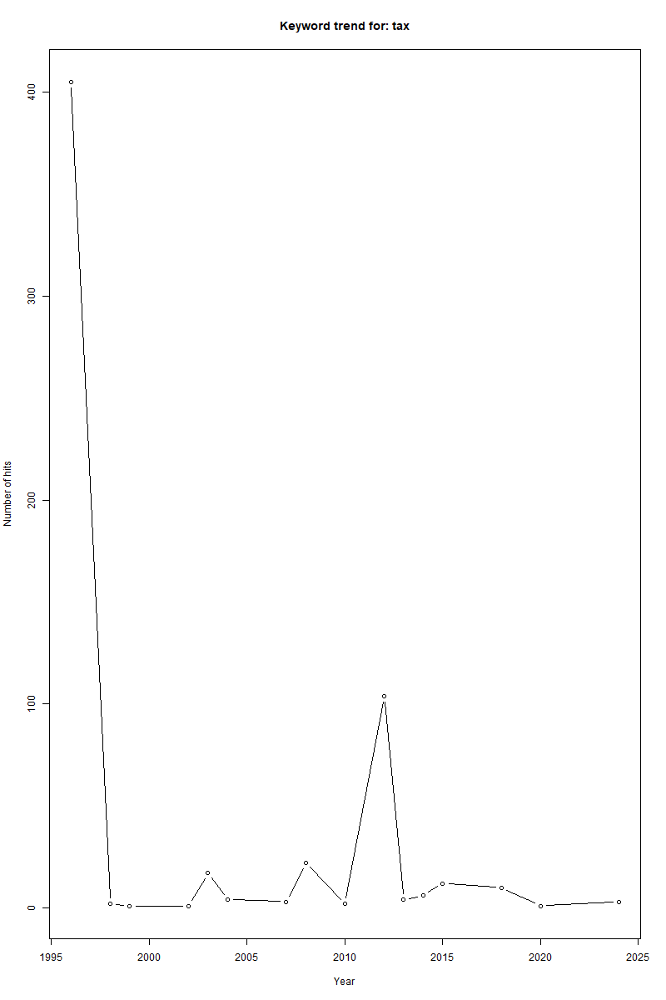
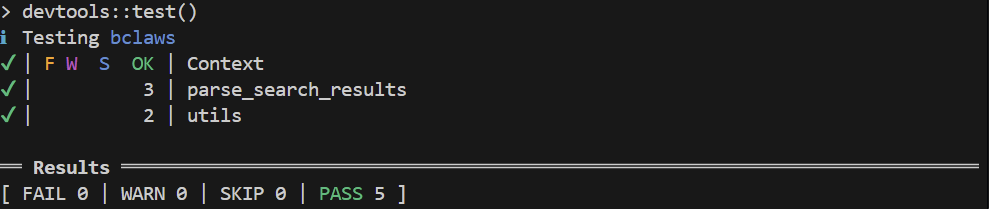

# bclaws

This package provides a small set of functions to **search BC laws**, **parse search results**, **compute simple keyword trends over time**, and **fetch plain-text law content**.

Course project for **DATA 534**


## Authors
- Jingtao Yang
- Yiran Wang
- Zihao Zhao


## Features

- **Search** BC Laws using the Civix endpoint (`search_laws()`)
- **Parse** raw search XML into a tidy `data.frame` (`parse_search_results()`)
- **Keyword trend** summary by year / law type (`keyword_trend()`, `keyword_trend_paged()`)
- **Plot** keyword trends (`plot_keyword_trend()`)
- **Fetch full text** for a given law (`get_law_text()`)
- **AI summary generation** for a given law (`summarize_keyword_trend()`)


## Dependencies

This package requires the following R packages:

- **httr2**: For making HTTP requests to the BC Laws Civix API
- **xml2**: For parsing XML responses from the API

These dependencies will be automatically installed when you install the package.


## Data Source

This package wraps the **BC Laws Civix REST API** provided by the Government of British Columbia.

- **API endpoint**: `https://www.bclaws.ca/civix`
- **Official website**: [BC Laws](https://www.bclaws.gov.bc.ca/)
- **License**: The data is provided by the BC government and subject to their terms of use


## Rate Limiting & Usage Note
- **Possible rate limits**: The API may throttle or block requests if too many are made in a short period
- **Recommended practice**: Add delays between requests when making multiple API calls
- **Timeout handling**: Functions may become slow or hang if rate limited. Consider setting appropriate timeouts
- **Polite usage**: Avoid making excessive requests; cache results when possible


## Installation

1. Run from the folder that contains `DESCRIPTION`:

```r
install.packages("devtools")
devtools::install(".")
library(bclaws)
```

2. Quick run using instructions from `demo_code.txt`
```r
# direct to the project root directory first
source("R/utils_api.R")
source("R/get_law_text.R")
source("R/search_laws.R")
source("R/parse_search_results.R")
source("R/keyword_trend.R")
source("R/demo.R")
source("R/keyword_trend_paged.R")
source("R/plot_keyword_trend.R")
source("R/ai_summary.R")

# example usage
keyword_you_want <- "tax"
demo_keyword_trend(keyword_you_want, from = 1990, to = 2025, type = "all", use_ai = TRUE)
```

## Quick start

### 1. Search and parse results
```r
library(bclaws)

doc  <- search_laws("tax", start = 0, end = 20)
hits <- parse_search_results(doc)

head(hits, 5)
```

hits columns:
- title
- law_type
- law_id
- loc
- hits

### 2. Compute a keyword trend
We compute a simple trend by (year, law_type), based on the metadata in results.
```r
trend <- keyword_trend_paged(
  keyword   = "tax",
  from      = 1990,
  to        = 2025,
  type      = "all",
  pages     = 10,
  page_size = 20
)

head(trend, 10)
```

### 3. Plot keyword trend
```r
plot_keyword_trend(trend, keyword = "tax")
```
This produces a basic time-series plot of total hits by year.


### 4. Fetch full text of a law
Pick a document from search hits:
```r
doc  <- search_laws("income tax", start = 0, end = 20)
hits <- parse_search_results(doc)

law_type <- hits$law_type[1]
law_id   <- hits$law_id[1]

txt <- get_law_text(law_type, law_id)
substr(txt, 1, 600)
```

## Vignette
A full end-to-end workflow (including plotting) is in: `vignettes/getting-started.Rmd`

Build vignettes locally:
```r
devtools::build_vignettes()
```

## Development
Generate documentation:
```r
devtools::document()
``` 
Run checks:
```r
devtools::check()
```
Run tests:
```r
devtools::test()
```

## Test Result
Test results from `devtools::test()`:


## License
MIT License

YEAR: 2026

COPYRIGHT HOLDER: bclaws authors
